# Cross-domain Typed Identifiers (CTI) version 1.0 Specification  <!-- omit in toc -->

## Abstract

**Cross-domain Typed Identifiers (CTI) version 1.0** specification (this document) defines a standardized approach for uniquely identifying data types, instances and their relationships in multi-service, multi-vendor, multi-platform and multi-application environments. By encoding essential information about vendor, package, and version, CTI ensures consistent, scalable identification of data types and instances in shared data storage, API objects, and documentation.

## Table of Content <!-- omit in toc -->

- [Abstract](#abstract)
- [Problem Statement](#problem-statement)
- [Introduction](#introduction)
  - [The CTI notation syntax](#the-cti-notation-syntax)
  - [Versioning](#versioning)
  - [Query language](#query-language)
  - [Attribute query](#attribute-query)
  - [Collecting identifiers](#collecting-identifiers)
    - [Using wildcard](#using-wildcard)
    - [Using version](#using-version)
  - [Extended Backus-Naur form](#extended-backus-naur-form)
- [CTI and metadata](#cti-and-metadata)
  - [Entity type schema language](#entity-type-schema-language)
  - [Metadata structure](#metadata-structure)
  - [Metadata format](#metadata-format)
  - [Data types and traits](#data-types-and-traits)
  - [Instances](#instances)
  - [CTI extensions](#cti-extensions)
    - [References](#references)
    - [Disallowing inheritance](#disallowing-inheritance)
    - [Limiting type specialization](#limiting-type-specialization)
    - [Access modifiers](#access-modifiers)
    - [Inserting CTI schemas](#inserting-cti-schemas)
- [Examples](#examples)
  - [Dynamic configuration through instances](#dynamic-configuration-through-instances)
  - [Extensible object types through type inheritance](#extensible-object-types-through-type-inheritance)
  - [Controlling the type behavior](#controlling-the-type-behavior)
    - [Expressing a relationship without an intermediate mapping](#expressing-a-relationship-without-an-intermediate-mapping)
  - [Using CTI for data objects access control](#using-cti-for-data-objects-access-control)
- [Types and instances definition with RAMLx 1.0](#types-and-instances-definition-with-ramlx-10)
  - [Translation between RAMLx 1.0 and CTI metadata](#translation-between-ramlx-10-and-cti-metadata)
    - [Type schema](#type-schema)
    - [Instance](#instance)
    - [Traits schema](#traits-schema)
    - [Trait values](#trait-values)
  - [Typed annotations](#typed-annotations)
  - [User-defined facets](#user-defined-facets)
  - [Annotations overview](#annotations-overview)
    - [cti.cti](#cticti)
    - [cti.id](#ctiid)
    - [cti.description](#ctidescription)
    - [cti.reference](#ctireference)
    - [cti.final](#ctifinal)
    - [cti.overridable](#ctioverridable)
    - [cti.schema](#ctischema)
    - [cti.access](#ctiaccess)
- [Packaging](#packaging)
  - [Package layout](#package-layout)
  - [Index file](#index-file)
  - [Package management](#package-management)
    - [Package identification](#package-identification)
    - [Sources](#sources)
    - [Versioning and compatibility](#versioning-and-compatibility)
    - [Caching](#caching)
    - [Dependency directory](#dependency-directory)
    - [Dependencies resolution](#dependencies-resolution)

## Problem Statement

In systems with contributions from multiple independent parties or vendors, unique identification is essential for interoperability, data integrity, and effective management. Outside of software, this need is addressed by common identification patterns across various fields. **[Peripheral Component Interconnect Code (Vendor ID (VID), Device ID (DID), Class Codes) and ID Assignment](https://pcisig.com/sites/default/files/files/PCI_Code-ID_r_1_11__v24_Jan_2019.pdf)** associated to Peripheral Component Interconnect (PCI) devices, **[ISBN-13 codes](https://www.isbn-international.org/content/isbn-bar-coding)** for books, **[GTIN (Global Trade Item Number)](https://www.gtin.info/what-is-a-gtin/)** for products, **[MAC addresses](https://en.wikipedia.org/wiki/MAC_address)** for network devices, and **[Payment Card Numbers](https://www.iso.org/obp/ui/#iso:std:iso-iec:7812:-1:ed-5:v1:en)** for credit cards are examples of conventions that encode essential details about the vendor, category, and instance into an identification code.

In software, this challenge becomes even more complex due to the dynamic, multi-vendor nature of environments like operating systems, cloud platforms, IoT ecosystems, and distributed microservices architectures. Here, unique identifiers must account for multiple vendors contributing different applications, services, data types, or specific identifiable data instances. To prevent conflicts and collisions and to ensure scalability and security, it is critical to have a standardized identification system that distinguishes each data type and instance while encoding vendor, application, and version information.

Programming languages typically define types for basic scalar data, like integers, strings, and booleans. Enums are often used to identify fixed sets of values, such as instance IDs or limited categories. More complex data structures, however, are represented by classes or structures whose names are unique only within the context of a compiled program or shared libraries. This approach limits the reliability of class-based identifiers in systems that exchange data through APIs or shared data storage, especially in multi-vendor environments where global uniqueness and cross-vendor, cross-service consistency are required.

There are several established identification systems and conventions for specific distributed applications or systems, including **[UUID](https://datatracker.ietf.org/doc/html/rfc4122)** for Universally Unique IDentifier, **[MIME types](https://datatracker.ietf.org/doc/html/rfc2045)** for mime formats, **[Java Package Naming Convention](https://docs.oracle.com/javase/tutorial/java/package/namingpkgs.html)** for namespace uniqueness in Java, **[Amazon ARN](https://docs.aws.amazon.com/IAM/latest/UserGuide/reference-arns.html)** for AWS resources, **[Apple UTI](https://developer.apple.com/documentation/uniformtypeidentifiers)** for data types on Apple platforms, and **[URL](https://url.spec.whatwg.org)** for web resource locations. While effective within their intended contexts, these systems are generally not suited for broader, generic identification of diverse data types or data objects.

To address these issues, **Cross-domain Typed Identifiers** provides an identifier notation that serves as a robust convention for identifying data entities across multi-service, multi-vendor, multi-platform and multi-application environments.

## Introduction

**Cross-domain Typed Identifiers (CTI)** is a conventional system that provides a structured, standardized approach for uniquely identifying data types, instances and their relationships across multi-service, multi-vendor, multi-platform and multi-application environments. By encoding essential information about vendor, package, and version, CTI ensures consistent, scalable identification of data types and instances in shared data storage, API objects, and documentation. Designed to support interoperability, CTI enables cross-platform compatibility and prevents conflicts by assigning each data type and instance a globally unique identifier that retains meaning and structure across contexts.

The CTI notations offer broad applicability. Here are just several examples of how they can be used:

- **API Data Type Definitions**: CTI ensures unique identification and data structures compatibility across different services and systems APIs.
- **UI Data Type Definitions**: CTI enables consistent definitions for UI components, such as form fields, dropdowns, and layout elements, ensuring compatibility and reusability of UI data types across different screens or control panels.
- **Event Schema Definitions**: CTI enables precise event schemas definition and events relationship streamlining, such as linking events to specific topics, managing hierarchical event types or referencing API data types in events payload.
- **Access Rights (Roles) Definitions**: CTI facilitates precise definition and versioning of user roles, permissions, and access rights, ensuring compatibility across services and enabling traceability in multi-system environments.
- **Configuration Management**: CTI can define and version application configurations, enabling dynamic updates and compatibility checks without manual intervention.
- **Database Schema Definitions**: CTI helps to organize and version database schemas, ensuring extensibility and compatibility of the schemas, which can be leveraged by database schemas migrations frameworks.
- **Data Warehouse Schema Management**: CTI simplifies managing and versioning large-scale data warehouse schemas, ensuring consistent definitions of datasets and enabling traceability across various data sources.

CTI are not limited to identifying data structures and instances alone; they also enable several advanced capabilities:

- **Cross-references**: Allow fields in one data object (e.g., type A) to reference objects of a different type (e.g., type B), enabling data linkages and associations across types.
- **Data class inheritance**: Supports type hierarchies, allowing type B to inherit from type A, promoting reusability and consistency in data models.
- **Data structure grouping**: Facilitates grouping by vendor or package, simplifying the organization and management of data structures within multi-vendor environments.

These capabilities enable CTI to support the construction of comprehensive, distributed, multi-vendor, and multi-service data type graphs and domain models. With CTI-based identification, organizations and cross-vendor platforms can manage data structures throughout their lifecycle, including aspects like data object relationships, access control, dependency, and compatibility management—creating a robust framework for scalable and secure data type systems management.

Similar to other notation systems (like [Apple Uniform Type Identifiers (UTIs)](https://developer.apple.com/documentation/uniformtypeidentifiers) or [Amazon Resource Names (ARNs)](https://docs.aws.amazon.com/IAM/latest/UserGuide/reference-arns.html)), CTI is represented by a string that uniquely identifies the resource (type or instance) and its origin (i.e., vendor and package). However, compared to other notation systems, CTI also express a relationship—specifying what type of object was instantiated or which type it extends—and include a [major and minor semantic version](https://semver.org/) (e.g., v1.0). This makes CTI a **powerful tool for precise versioning and compatibility tracking**, enabling developers to manage dependencies, relationships, and evolution of resource types within the CTI framework.

The following comparison table summarizes the comparison between the mentioned types:

|                             | Apple UTI                                  | Amazon ARN                                               | CTI                                      | Universally Unique Identifier (UUID) |
|-----------------------------|--------------------------------------------|----------------------------------------------------------|-----------------------------------------------------------|-------------------------------|
| Unique identifier           | Yes                                        | Yes                                                      | Yes                                                       | Yes                           |
| Provides access isolation   | Yes, UTI is scoped to an entity            | Yes, ARN is scoped to specific resource                  | Yes, CTI is scoped to specific vendor, package, entity    | No                            |
| Associated with a data type | Yes, UTI has associated format of the data | No                                                       | Yes, CTI is associated domain data type or domain object  | No                            |
| Extensible                  | No                                         | No                                                       | Yes, through inheritance                                  | No                            |
| Versioned                   | No                                         | No                                                       | Yes, using semantic versioning                            | No                            |
| Security                    | No, only handles file types                | Yes, can be used for IAM roles and permission management | Yes, can be used for IAM roles and permission management  | No                            |

### The CTI notation syntax

The CTI identifiers can be considered as `address` or `name` of the data types or individual objects.

The CTI identifier consists of two logical parts:

1. Base part that begins with `cti.` and helps to identify the string as a CTI. For example, a fully qualified name of a CTI will be `cti.<vendor>.<package_name>.<entity_name>.v<major_version>.<minor_version>`.
1. Cross-domain Typed Identifiers Extension (CTX) part that is appended to CTI using the `~` character and extends (through inheritance or instantiation) the preceding identifier. For example, a fully qualified name of a CTI with CTX will be `cti.<vendor>.<package_name>.<entity_name>.v<major_version>.<minor_version>~<vendor>.<package_name>.<entity_name>.v<major_version>.<minor_version>`.

Each segment in these parts is dot-separated, where:

* `<vendor>` - a name of the vendor that created the identifier.
* `<package_name>` - a name of the package that includes this entity.
* `<entity_name>` - a name of the entity.
* `v<major_version>.<minor_version>` - a semantic version of the entity that includes major and minor versions.

With all this data, the entity origin can be identified (vendor and package name), its name and version.

Few examples of identifiers:

* `cti.a.p.event.v1.0` - vendor **a** defines an **event version 1.0** in package **p**.
* `cti.a.p.event.v1.0~a.p.user.logged_in.v1.0` - vendor **a** defines a **user logged in event version 1.0** in package **p** that extends **event version 1.0** of vendor **a** in package **p**.

### Versioning

CTI follow [semantic versioning](https://semver.org/) where entity version is identified by `v<major>.<minor>`, where `<major>` is a major version and `<minor>` is a minor version.

The entity version does not impose any restrictions on the identifier itself. However, it imposes restrictions on the metadata compatibility
associated with this identifier.

### Query language

> [!IMPORTANT]
> CTI containing a query may not serve as an identifier of a type or instance.

Query language, similar to XPath language, allows the developers to narrow scope by specific attributes. Query syntax can be applied to a CTI by appending a list of attribute name and attribute value parameters in square brackets. For example: `<cti>[ <attribute name>="<attribute value>", <attribute name2>="<attribute value>", ... ]`.

Both common values and values in CTI format could be referenced with CTI queries, e.g.:

* cti.a.p.message.v1.0[ topic_id="cti.a.p.topic.v1.0" ]
* cti.a.p.topic.v1.0[ type="informational" ]

It's possible to use multiple query parameters to limit the resulting scope by logical 'AND' of individual filters:

* cti.a.p.topic.v1.0[ type="informational", organization="b5a19f80-f68e-41bc-bbf4-cc6fd106a8a4" ]

### Attribute query

> [!IMPORTANT]
> CTI containing an attribute query may not serve as an identifier of a type or instance.

Similar to JSONPath dot notation, CTI provides the attribute selector that allows the developers to get an attribute value of the CTI instance. Attribute selector can be applied to a CTI that is bound to an instance by appending the `@` to the identifier and specifying a property path. For example: `<cti>@<root_attr_name>.<nested_attr_name>`.

The attribute selector always starts from the instance's root and allows for getting only one attribute at a time. For example:

* cti.a.p.message.v1.0@id - get a message identifier from the `id` field.

Nested attributes also can be accessed within the instance's structure. For example:

* cti.a.p.message.v1.0@data.item - get the `item` property value from the `data` field.

### Collecting identifiers

The specification provides several means to match and collect identifiers.

> [!IMPORTANT]
> CTIs containing the following notations may not serve as identifiers of a type or instance.

#### Using wildcard

A wildcard (`*`) character can be used to find all entities by any sequence of characters after it. Note that this is a greedy operator and it will also match the tilde (`~`) character. Due to the nature of this operator, it must adhere to the following rules:

1. Any segment of the CTI notation, except `cti.`, may be replaced with the wildcard.
1. Wildcard must be used only once and only at the end of the identifier.
1. Wildcard must replace the whole segment.
1. Attribute selector and query must not be used with the wildcard.

For example, given the following list of identifiers:

```
cti.a.p.message.v1.0
cti.a.p.message.v1.0~a.p.user_logged_in.v1.0
cti.a.p.message.v1.0~a.p.user_logged_out.v1.1
cti.a.p.message.v1.1
```

The following examples demonstrate a valid usage of the wildcard:

```
# Find all children down the chain
cti.a.p.message.v1.0~*
Expected result:
[
  cti.a.p.message.v1.0~a.p.user_logged_in.v1.0
  cti.a.p.message.v1.0~a.p.user_logged_out.v1.1
]

# Find all versions of an identifier and its children
cti.a.p.message.v*
[
  cti.a.p.message.v1.0
  cti.a.p.message.v1.0~a.p.user_logged_in.v1.0
  cti.a.p.message.v1.0~a.p.user_logged_out.v1.1
  cti.a.p.message.v1.1
]
```

The following examples demonstrate an invalid usage of the wildcard:

```
# Wildcard does not replace the segment
cti.v.pk*

# Wildcard is not in the end
cti.v.*.v1.0

# Multiple wildcards used
cti.a.p.v*.*
```

#### Using version

In case a wildcard is too broad, it is possible to look up multiple versions of a specific identifier.

For example, given the following list of identifiers:

```
cti.a.p.message.v1.0
cti.a.p.message.v1.0~a.p.user_logged_in.v1.0
cti.a.p.message.v1.0~a.p.user_logged_out.v1.1
cti.a.p.message.v1.1~a.p.user_logged_in.v1.0
cti.a.p.message.v1.1
cti.a.p.message.v2.0
```

The following examples demonstrate how the input identifier may match against the listed items:

```
# Using a concrete version, collects all derived entities of this version.
cti.a.p.message.v1.0
[
  cti.a.p.message.v1.0
  cti.a.p.message.v1.0~a.p.user_logged_in.v1.0
  cti.a.p.message.v1.0~a.p.user_logged_out.v1.1
]

# Using a major-only version, collects all base entities and their derived entities.
cti.a.p.message.v1
[
  cti.a.p.message.v1.0
  cti.a.p.message.v1.0~a.p.user_logged_in.v1.0
  cti.a.p.message.v1.0~a.p.user_logged_out.v1.1
  cti.a.p.message.v1.1~a.p.user_logged_in.v1.0
  cti.a.p.message.v1.1
]

# Using no version, collects all entities of the specified identifier
cti.a.p.message.v
[
  cti.a.p.message.v1.0
  cti.a.p.message.v1.0~a.p.user_logged_in.v1.0
  cti.a.p.message.v1.0~a.p.user_logged_out.v1.1
  cti.a.p.message.v1.1~a.p.user_logged_in.v1.0
  cti.a.p.message.v1.1
  cti.a.p.message.v2.0
]
```

### Extended Backus-Naur form

A complete syntax of CTI is represented using the following Extended Backus-Naur form:

```
  CTI = "cti.", ctx, {"~", ctx}, ["~", uuid], [query | attribute_query];

  CTX = (vendor, ".", package_id, ".", entity_name, ".", version) |
        (vendor, ".", package_id, ".", entity_name, ".", wildcard) |
        (vendor, ".", package_id, ".", wildcard) |
        (vendor, ".", wildcard) |
        wildcard;

  attribute_selector = symbol, [".", symbol];

  attribute_query = "@", attribute_selector, {attribute_selector};

  query = "[", kwarg, {",", kwarg}, "]";

  kwarg = key, "=", value;

  key = (letter | "_"), {symbol};

  value = unescaped_single_string | unescaped_double_string;

  any_character = ? . ?;

  unescaped_single_string = "'", {escape_sequence | any_character - ("'" | "\\")}, "'";

  unescaped_double_string = '"', {escape_sequence | any_character - ('"' | "\\")}, '"';

  escape_sequence = "\\", ("a" | "b" | "f" | "n" | "r" | "t" | "v" | "'" | '"' | "\\");

  package_id = letter, {symbol};

  vendor = letter, {symbol};

  version = "v" | ("v", wildcard | (version_number, ".", (version_number | wildcard)));

  version_number = digit, {digit};

  entity_name = domain_name_part, {".", domain_name_part};

  simple_name = letter_or_digit | letter_or_digit, {symbol}, letter_or_digit;

  domain_name_part = simple_name | "_", [simple_name, "_"];

  uuid = 8*letter_or_digit, "-", 4*letter_or_digit, "-", 4*letter_or_digit, "-", 4*letter_or_digit, "-", 12*letter_or_digit;

  letter = "a"| "b" | "c" | "d" | "e" | "f" | "g" | "h" | "i" | "j" | "k" | "l" | "m" | "n" | "o" | "p" | "q" | "r" | "s" | "t" | "u" | "v" | "w" | "x" | "y" | "z";

  digit_nz = "1" | "2" | "3" | "4" | "5" | "6" | "7" | "8" | "9";

  digit = "0" | digit_nz;

  letter_or_digit = letter | digit;

  symbol = letter_or_digit | "_";

  wildcard = "*";
```

## CTI and metadata

A CTI serves solely as a unique identifier for an entity and establishes a syntactic relationship between the entities via inheritance.
It does not encode the information about the domain model (or data that conforms to the domain model) of the entity.
To express this information for a CTI, metadata is used. Metadata defines the structure, constraints, and configurable traits of the entity.

This approach aligns with Domain-Driven Design (DDD) principles: platform developers define the domain model declaratively using CTIs as identifiers,
and combine them with metadata to establish a contract between the domain and the implementation. Vendors can then extend this domain model
by deriving their own types, inheriting the semantics and behavior, and specifying behavior by traits, if applicable.

The specification defines the following two types of entities that can be represented by a CTI:

1. Type - an extensible data type schema that expresses a domain object type.
2. Instance - a static data that conforms the parent data type schema and specifies its behavior.

### Entity type schema language

CTI specification is not bound to a specific data type language. Instead, it integrates with existing data type
languages such as [JSON Schema](https://json-schema.org/) and [RAMLx](https://raml.org/) (covered by this specification),
while providing additional capabilities and metadata on top of them. For example, with CTI you can:

1. Define inheritance relationship between types (not available in JSON Schema).
2. Allow or disallow inheritance (sealed type) (not available in any language).
3. Allow or disallow narrowing specific properties of the type (not available in any language).
4. Express a relationship between objects by specifying a reference (not available in any language).
5. Define traits schema and traits that control specific behavior of the type (not available in JSON Schema).

All examples in this specification use [JSON Schema Draft-7](https://json-schema.org/) as a data type language, unless stated otherwise.

### Metadata structure

The specification defines a standard metadata structure that implementations can use to describe CTI entities:

| **Field**     | **Type** | **Description**                                                                                                               |
|---------------|----------|-------------------------------------------------------------------------------------------------------------------------------|
| cti           | CTI      | Identifier of the CTI entity.                                                                                                 |
| final         | boolean  | Indicates that the CTI entity is final and cannot have derived entities. CTI instances are final by default.                  |
| access        | string   | Specifies an [access modifier](#access-modifiers) for the CTI metadata.                                                       |
| display_name  | string   | A human-readable name of CTI entity.                                                                                          |
| description   | string   | A human-readable description of CTI entity.                                                                                   |
| schema        | object   | Data type schema. Only present for [CTI types](#data-types-and-traits).                                                       |
| values        | any      | [Arbitrary values](#instances) that follow the parent schema. Only present for CTI instances.                                 |
| traits_schema | object   | [Traits schema](#data-types-and-traits). Only present for CTI types.                                                          |
| traits        | object   | [An object of arbitrary key-values](#data-types-and-traits) that follow the parent traits schema. Only present for CTI types. |
| annotations   | object   | An object where key is a path to annotated property and value is an object.                                                   |

### Metadata format

A standard metadata format that is defined by this specification is a YAML 1.2 document with a corresponding header.
There are two types of document headers:

- `#%CTI Type 1.0` for CTI types.
- `#%CTI Instance 1.0` for CTI instances.

A header must have no leading or trailing spaces and must be the first line of the document.

An example of a CTI type metadata document:

```yaml
#%CTI Type 1.0
cti: cti.a.p.topic.v1.0
final: false
access: public
display_name: Event Topic
description: An event topic that is used to group events.
schema:
  $schema: http://json-schema.org/draft-07/schema#
  $ref: "#/definitions/Topic"
  definitions:
    Topic:
      type: object
      properties:
        name:
          type: string
          description: A name of the topic.
        retention:
          type: string
          description: A retention duration of the events created in this topic.
      required: [ name, retention ]
```

An example of a CTI instance metadata document (based on the schema above):

```yaml
#%CTI Instance 1.0
cti: cti.a.p.topic.v1.0~a.p.user.v1.0
final: true
access: public
display_name: User-related events topic
description: A topic for user-related events.
values:
  name: User-related events topic.
  retention: 30d
```

### Data types and traits

A CTI can be associated with a data type schema that may be used in the following ways:

- Platform developers may define base (abstract) types that represent a contract between the domain and the implementation.
  To make the domain configurable, platform developers may also specify a **traits schema** to allow vendors to manage the behavior of the domain.
- Vendors may derive concrete types (or another abstract type depending on the domain complexity), inheriting the semantics and behavior.
  If supported by the domain, additionally specifying the behavior by **traits**.

This allows platform developers to control the way in which their domains can be extended and configured.

For example, a platform developer may introduce an abstract alert type that provides configurable alert generation rules
and standard alert behaviors such as dismissal flow, rendering flow, etc. Concrete alert types derived by the vendor
will preserve these behaviors and will also have an ability to configure the alert generation rules via traits.

### Instances

A CTI can be associated with a static data that conforms the parent data type schema and specifies its behavior.

CTI instances are particularly useful for defining static configuration, such as predefined service configuration,
intermediate mapping, templates, rules, etc.

Platform developers and vendors may create instances to dynamically configure the behavior of the domain.

### CTI extensions

#### References

In addition to inheritance, platform developers can express relationship between different CTIs
within the schema and validate the values using the `x-cti.reference` (JSON Schema) or `(cti.reference)` (RAMLx 1.0) extension.
For example, a schema may specify that a specific field is a reference to a CTI:

```yaml
#%CTI Type 1.0
cti: cti.a.p.event.v1.0
# ...
traits_schema:
  $schema: http://json-schema.org/draft-07/schema#
  $ref: "#/definitions/cti-traits"
  definitions:
    cti-traits:
      type: object
      properties:
        topic_id:
          type: string
          description: A CTI reference to the event topic.
          x-cti.reference: cti.a.p.topic.v1.0 # CTI validator will validate that the value matches this CTI.
```

A concrete event type will then be able to specify the `topic_id` field as a reference to a specific topic:

```yaml
#%CTI Type 1.0
cti: cti.a.p.event.v1.0~a.p.user.log_in_attempt.v1.0
# ...
traits:
  # A valid value since cti.a.p.topic.v1.0~a.p.user.v1.0 matches cti.a.p.topic.v1.0
  topic_id: cti.a.p.topic.v1.0~a.p.user.v1.0
```

#### Disallowing inheritance

Vendors may disallow inheritance of specific types to avoid deriving from types that are not meant to be extended.
This is controlled by the `final` property in the metadata. By default, all types are final and cannot be extended.
For example, the following type schema defines a final type that cannot be extended:

```yaml
#%CTI Type 1.0
cti: cti.a.p.topic.v1.0
final: true
# ...
```

This makes the following type schema invalid:

```yaml
#%CTI Type 1.0
# Invalid since cti.a.p.topic.v1.0 is final and cannot be extended
cti: cti.a.p.topic.v1.0~a.p.user.v1.0
# ...
```

Note that this does not prevent instances from being created based on the final type. It only prevents other types from extending it.

#### Limiting type specialization

Platform developers and vendors may limit type specialization by allowing other vendors to specialize only specific properties.
By default, all properties of a type are not allowed to be specialized. For example, the following type schema defines a type that allows specialization of the `data` property only:

```yaml
#%CTI Type 1.0
cti: cti.a.p.topic.v1.0
# ...
schema:
  $schema: http://json-schema.org/draft-07/schema#
  $ref: "#/definitions/Topic"
  definitions:
    Topic:
      type: object
      properties:
        # ...
        data:
          type: object
          description: An event payload.
          x-cti.overridable: true # This property can be specialized by other vendors.
```

#### Access modifiers

Vendors may use access modifiers, akin to object-oriented programming languages, to limit access to specific types and instances to prevent other vendors from extending private parts of the domain. This is controlled by the `access` property in the metadata.

The following access modifiers are available:

- Public - allowed to be referenced by anyone.
- Protected - allowed to be referenced only by the same vendor.
- Private - allowed to be referenced only by the same package.

When deriving a type, the access modifier must be the same or more restrictive than the parent type. Setting a less restrictive access modifier is not allowed.

By default, all types and instances are protected, meaning that they can be referenced only by the same vendor. This is done to prevent accidental exposure of types and instances to other vendors.

#### Inserting CTI schemas

Platform developers and vendors may insert CTI schemas within their data type schemas to reuse existing types, enabling schema composition using CTI types. This is done by using the `x-cti.schema` (JSON Schema) or `(cti.schema)` (RAMLx 1.0) extension.

For example, the following type schema defines a type that uses the `cti.a.p.topic.v1.0` type schema as a base:

```yaml
#%CTI Type 1.0
cti: cti.a.p.event.v1.0
# ...
schema:
  $schema: http://json-schema.org/draft-07/schema#
  $ref: "#/definitions/Event"
  definitions:
    Event:
      type: object
      properties:
        id:
          type: string
          description: A unique identifier of the event.
          format: uuid
        topic_id:
          type: string
          description: A unique identifier of the event topic.
          x-cti.schema: cti.a.p.topic.v1.0 # This will insert the topic schema into the event schema.
        type:
          type: string
          description: A CTI that was used to create the event.
        data:
          type: object
          description: An event payload.
      required: [ id, topic_id, type, data ]
```

## Examples

### Dynamic configuration through instances

Let us consider the following simple entity-relationship diagram that demonstrates the **event topic** structure.

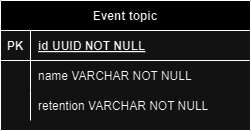

Instead of using UUID, we can replace it with a CTI and extend the diagram as follows:

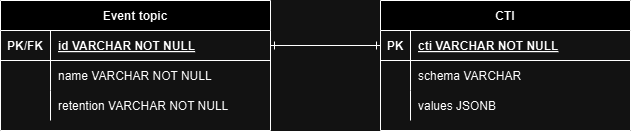

By introducing CTI, a vendor may easily introduce a new event topic object without the need to generate a random identifier. Additionally, it becomes possible to implement a dynamically extensible configuration since new objects become available to the upstream services immediately.

For example, let us assume that the **CTI** table contains the following CTI with the base event type schema:

```yaml
#%CTI Type 1.0
cti: cti.a.p.topic.v1.0
# ...
schema:
  $schema: http://json-schema.org/draft-07/schema#
  $ref: "#/definitions/Topic"
  definitions:
    Topic:
      type: object
      properties:
        name:
          type: string
          description: A name of the topic.
        retention:
          type: string
          description: A retention duration of the events created in this topic.
      required: [ name, retention ]
```

Now, we can dynamically create a new event topic by simply creating a new instance based on this data type:

```yaml
#%CTI Instance 1.0
cti: cti.a.p.topic.v1.0~a.p.user.v1.0
# ...
values:
  name: User-related events topic.
  retention: 30d
```

With a new topic registered through CTI, it now becomes possible to attach events to this topic without re-deploying or re-configuring the service.

### Extensible object types through type inheritance

Let us consider the following simple entity-relationship diagram that demonstrates the **event** structure.

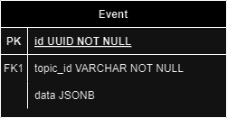

In an extensible system, this structure is impossible to validate since `data` provided with the event can contain an arbitrary JSON value which schema may be unknown. To address this issue, a `type` field can be introduced that points to a specific CTI.

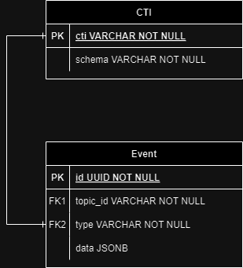

By introducing CTI, a vendor may define a base data type for the event that can be extended further by anyone. For example, let us assume that the **CTI** table contains the following CTI with the base event schema:

```yaml
#%CTI Type 1.0
cti: cti.a.p.event.v1.0
# ...
schema:
  $schema: http://json-schema.org/draft-07/schema#
  $ref: "#/definitions/Event"
  definitions:
    Event:
      type: object
      properties:
        id:
          type: string
          description: A unique identifier of the event.
          format: uuid
        topic_id:
          type: string
          description: A unique identifier of the event topic.
        type:
          type: string
          description: A CTI that was used to create the event.
        data:
          type: object
          description: An event payload.
          x-cti.overridable: true # This property can be specialized by other vendors.
      required: [ id, topic_id, type, data ]
```

Now, the same or the other vendor may specify a concrete `data` schema and therefore dynamically register a new event that adheres to the domain:

```yaml
#%CTI Type 1.0
cti: cti.a.p.event.v1.0~a.p.user.log_in_attempt.v1.0
# ...
schema:
  $schema: http://json-schema.org/draft-07/schema#
  $ref: "#/definitions/UserLogInAttemptEvent"
  definitions:
    UserLogInAttemptEvent:
      type: object
      properties:
        data:
          type: object
          properties:
            user_agent:
              type: string
              description: A User-Agent of the browser that was used in log in attempt.
          required: [ user_agent ]
      required: [ data ]
```

### Controlling the type behavior

Using **Traits**, it is possible to create concrete types with specific behavior that the service, that serves that domain, expects.

#### Expressing a relationship without an intermediate mapping

Let us consider the following entity-relationship diagram where a specific **event** is associated with an **event topic**:

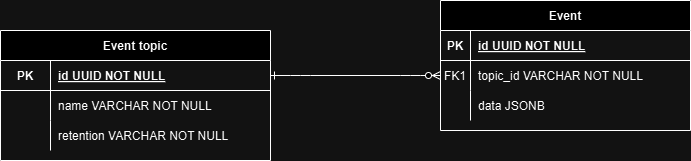

This relationship cannot be expressed declaratively since that would require knowing a UUID which may be random in different systems.
Instead of UUID, we can use CTI to express the association of an event with specific event topic:

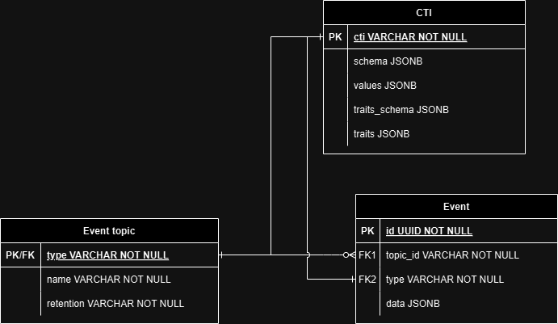

By introducing CTI, we can express this association via type traits. A base type may define specific traits that a derived type can specify.

For example, let us assume that the **CTI** table contains the following CTI with the base event schema:

```yaml
#%CTI Type 1.0
cti: cti.a.p.event.v1.0
# ...
schema:
  $schema: http://json-schema.org/draft-07/schema#
  $ref: "#/definitions/UserLogInAttemptEvent"
  definitions:
    Event:
      properties:
        id:
          type: string
          description: A unique identifier of the event.
          format: uuid
        topic_id:
          # NOTE: An object may carry a topic ID to allow the clients to identify the topic.
          # It is not directly related to the trait defined along with the schema.
          type: string
          description: A unique identifier of the event topic.
        type:
          type: string
          description: A CTI that was used to create the event.
        data:
          type: object
          description: An event payload.
          x-cti.overridable: true # This property can be specialized by other vendors.
      required: [ id, topic_id, type ]
traits_schema:
  $schema: http://json-schema.org/draft-07/schema#
  type: object
  properties:
    topic_id:
      type: string
      description: A reference to specific event topic.
  required: [ topic_id ]
```

Now, other vendors may not only specify a concrete `data` schema, but also specify the CTI of the topic that will be associated with this event:

```yaml
#%CTI Type 1.0
cti: cti.a.p.event.v1.0~a.p.user.log_in_attempt.v1.0
schema:
  $schema: http://json-schema.org/draft-07/schema#
  $ref: "#/definitions/UserLogInAttemptEvent"
  definitions:
    UserLogInAttemptEvent:
      type: object
      properties:
        data:
          type: object
          description: An event payload.
          properties:
            user_agent:
              type: string
              description: A User-Agent of the browser that was used in log in attempt.
          required: [ user_agent ]
      required: [ data ]
traits:
  topic_id: cti.a.p.topic.v1.0~a.p.user.v1.0
```

### Using CTI for data objects access control

The CTI identifier notation is a powerful tool for managing data access control and performing access checks at runtime. It can be effectively utilized for implementing **Attribute-Based Access Control** (ABAC) as well as defining roles for **Role-Based Access Control** (RBAC). Services implementing APIs can leverage CTI identifiers to grant or deny access to specific objects or categories of objects based on their types. For example [self-encoded JWT tokens](https://auth0.com/docs/secure/tokens/json-web-tokens) might have the list of granted `scopes` in form of CTIs, with support for wildcard shortcuts. Here’s a sample API JWT token:

```jsonc
{
  // Token issuer identifier is Vendor's Platform
  "iss": "cti.vendor.platform.auth.v1.0",
  // Subject: API client (or user) identifier
  "sub": "e0d31952-f46f-4e2a-9327-ee04a0eef544",
  // Expiration time (Unix timestamp)
  "exp": 1700000000,
  // Issued at time (Unix timestamp)
  "iat": 1690000000,
  // ABAC example
  "scope": [
    // Grant access to read all the objects with type inherited from cti.vendor.platform.task.v1.0
    "cti.vendor.platform.task.v1.0~*:read",
    // Read-only access to all the objects introduced by 'Integration App' from 'Partner Vendor'
    "cti.partner_vendor.integration_app.*:read"
    // Admin access to specific alert object with given UUID
    "cti.vendor.platform.alert.v1.0~2181ab50-a526-4507-901a-64af98b3be53:admin",
    // Additional Admin access to all alerts with ~vendor.platform.license_expired.v1.0 type
    "cti.vendor.platform.alert.v1.0~vendor.platform.license_expired.v1.0:admin",
  ],
  // RBAC example
  "roles": [
    // The API client (or user) gets the read-only admin permissions for Platform services
     "cti.vendor.platform.role.v1.0~vendor.platform.read_only_admin.v1.0",
     // Additionally, it gets some 'support engineer' permissions in the 'Integration App'
     "cti.vendor.platform.role.v1.0~partner_vendor.integration_app.support_engineer.v1.0"
  ]
}
```

Similarly, access control rules can be applied to database tables, events, configuration files, and other objects for enforcing appropriate access checks.

With the query language and CTI collection syntax, it is possible to grant access to a specific CTI entity or a list of CTIs
that an identity may have access to. The following table shows of claims and their scope of access:

| **Claim example**                                                                  | **Description**                                                                                                  |
|------------------------------------------------------------------------------------|------------------------------------------------------------------------------------------------------------------|
| cti.a.p.am.alert.v1.0~vendor.pkg.*                                                 | Access to all alerts of types introduced by **vendor.pkg** package and **all** its sub-packages and sub-vendors. |
| cti.a.p.am.alert.v1.0~vendor.pkg.alert.v1.0                                        | Access to the alert introduced by **vendor.pkg** package.                                                        |
| cti.a.p.am.alert.v1.0[ category="cti.a.p.category.v1.0~vendor.pkg.category.v1.0" ] | Access to all alerts in a category introduced by **vendor.pkg** package.                                         |

## Types and instances definition with RAMLx 1.0

To express CTI semantics and describe domain object types and define static object instances using [RAML 1.0](https://github.com/raml-org/raml-spec/blob/master/versions/raml-10/raml-10.md/), CTI specification defines a RAMLx 1.0 extension.
RAML 1.0 provides a data type system capable of working with inheritance and provides means to extend semantics of the types.

To express types, traits, and instances as well as additional semantics defined in RAMLx, RAMLx utilizes two RAML features: [annotations](https://github.com/raml-org/raml-spec/blob/master/versions/raml-10/raml-10.md#annotations) and [user-defined facets](https://github.com/raml-org/raml-spec/blob/master/versions/raml-10/raml-10.md#user-defined-facets).

### Translation between RAMLx 1.0 and CTI metadata

In RAMLx 1.0, the CTI metadata is represented as a RAML 1.0 library that contains type definitions, annotations, and annotation types.
Instead of defining dedicated metadata structure, the metadata is expressed using RAML 1.0 annotations and bound directly to the type definitions.
The following sections describe how RAMLx 1.0 maps CTI metadata to RAML 1.0 constructs.

#### Type schema

RAMLx 1.0:

```yaml
#%RAML 1.0 Library

uses:
  cti: cti.raml

types:
  A:
    (cti.cti): cti.a.p.aaa.v1.0
    properties:
      attr: string
```

CTI metadata type `A`:

```yaml
#%CTI Type 1.0
cti: cti.a.p.aaa.v1.0
final: true
access: protected
display_name: A
schema:
  $schema: http://json-schema.org/draft-07/schema#
  $ref: "#/definitions/A"
  definitions:
    A:
      type: object
      properties:
        attr:
          type: string
      required: [ attr ]
```

#### Instance

RAMLx 1.0:

```yaml
#%RAML 1.0 Library

uses:
  cti: cti.raml

annotationTypes:
  Instances:
    type: A[]

types:
  A:
    (cti.cti): cti.a.p.aaa.v1.0
    properties:
      id:
        type: cti.CTI
        (cti.id): true
      name:
        type: string
        (cti.display_name): true

(Instances):
- id: cti.a.p.aaa.v1.0~a.p.bbb.v1.0
  name: Instance of A
```

CTI metadata type `A`:

```yaml
#%CTI Type 1.0
cti: cti.a.p.aaa.v1.0
final: false
access: protected
display_name: A
schema:
  $schema: http://json-schema.org/draft-07/schema#
  $ref: "#/definitions/A"
  definitions:
    A:
      type: object
      properties:
        attr:
          type: string
      required: [ attr ]
```

CTI metadata instance of `A`:

```yaml
#%CTI Instance 1.0
cti: cti.a.p.aaa.v1.0~a.p.bbb.v1.0
final: true
access: protected
display_name: Instance of A
values:
  id: cti.a.p.aaa.v1.0~a.p.bbb.v1.0
  name: Instance of A
```

#### Traits schema

RAMLx 1.0:

```yaml
#%RAML 1.0 Library
uses:
  cti: cti.raml
types:
  A:
    (cti.cti): cti.a.p.aaa.v1.0
    facets:
      cti-traits:
        properties:
          val: integer
```

CTI metadata type `A`:

```yaml
#%CTI Type 1.0

cti: cti.a.p.aaa.v1.0
final: false
access: protected
display_name: A
traits_schema:
  $schema: http://json-schema.org/draft-07/schema#
  $ref: "#/definitions/cti-traits"
  definitions:
    cti-traits:
      type: object
      properties:
        val:
          type: integer
          description: A trait value.
      required: [ val ]
```

#### Trait values

RAMLx 1.0:

```yaml
#%RAML 1.0 Library

uses:
  cti: cti.raml

types:
  A: # As defined above
  B:
    type: A
    (cti.cti): cti.a.p.aaa.v1.0~a.p.bbb.v1.0
    cti-traits:
      val: 10
```

CTI metadata type `B`:

```yaml
#%CTI Type 1.0

cti: cti.a.p.aaa.v1.0~a.p.bbb.v1.0
final: true
access: protected
display_name: B
traits:
  val: 10
```

### Typed annotations

RAML 1.0 annotations are used to define additional semantics of types or individual object properties. For example, the `cti.cti` annotation is used to create and bind a CTI to this type.

The `cti.id` annotation defines that the object property contains an identifier derived from the base type and the object follows the base type schema. This allows registering static object instances that can be used to specify any pre-defined values (i.e., service configuration, static properties, etc.) and refer to them later.

The `cti.overridable` specifies that the object property can be specialized by the derived type (for example, if the base type property has an object type that does not define any schema, the derived type may define its own schema for this property).

```yaml
#%RAML 1.0 Library

uses:
  cti: cti.raml

types:
  Category:
    (cti.cti): cti.a.p.category.v1.0
    properties:
      type:
        type: cti.CTI
        (cti.id): true
      name:
        type: string
        description: A human-readable name of the abstract category.
        (cti.display_name): true
      description:
        type: string
        description: A human-readable description of the abstract category.
```

RAMLx also uses annotations to specify type instances together with type definitions in RAML files. The author of the base type must define a special annotation type that will be used to create such instances. The following example shows how an instance `Category` type can be specified in the same RAML file:

```yaml
#%RAML 1.0 Library

uses:
  cti: cti.raml

types:
  Category:
    (cti.cti): cti.a.p.category.v1.0
    properties:
      type:
        type: cti.CTI
        (cti.id): true
      name:
        type: string
        description: A human-readable name of the abstract category.
        (cti.display_name): true
      description:
        type: string
        description: A human-readable description of the abstract category.

annotationTypes:
  Categories:
    type: Category[]
    allowedTargets: [ Library ]

(Categories):
- id: cti.a.p.category.v1.0~a.p.general.v1.0
  name: General
  description: A general-purpose category that can apply to anything.

- id: cti.a.p.category.v1.0~a.p.security.v1.0
  name: Security
  description: A security category that includes everything for efficient cyber protection.
```

RAMLx additionally provides the `cti.type` annotation that allows validating the object instance against the specified type. For example:

```yaml
#%RAML 1.0 Library

types:
  Message:
    (cti.cti): cti.a.p.message.v1.0
    properties:
      id: uuid
      type:
        type: cti.CTI
        (cti.type): true
      payload:
        type: object
        (cti.overridable): true

  WeatherForecast:
    type: Message
    (cti.cti): cti.a.p.message.v1.0~a.p.weather_forecast.v1.0
    properties:
      payload:
        date: datetime
        location: string
        temperature: number

annotationTypes:
  WeatherForecastMessages:
    type: WeatherForecast[]
    allowedTargets: [ Library ]

# RAMLx will provide static validation according to the type specified in annotation.
(WeatherForecastMessages):
- id: 1bbf7975-f87a-440a-96c1-42c1e41bd505
  type: cti.a.p.message.v1.0~a.p.weather_forecast.v1.0 # Service may use this field to validate the payload.
  payload:
    date: 2022-12-31
    location: Uludağ, Türkiye
    temperature: 9

- id: 91d2af3a-0079-4889-ac2b-ffca0a227259
  type: cti.a.p.message.v1.0~a.p.weather_forecast.v1.0
  payload:
    date: 2022-12-31
    location: Sofia, Bulgaria
    temperature: 9
```

### User-defined facets

RAML 1.0 [user-defined facets](https://github.com/raml-org/raml-spec/blob/master/versions/raml-10/raml-10.md#user-defined-facets) provide a way to express additional user-defined restrictions imposed on the instances of their types. RAMLx uses this feature by specifying a special facet name called `cti-traits` in the base type. This facet defines the traits schema that the derived type must implement. In the following example, the `Message` base type defines the retention semantics in its traits that the vendor may use to define the required retention period of its messages in its derived `WeatherForecast` type:

```yaml
#%RAML 1.0 Library

uses:
  cti: cti.raml

types:
  Message:
    (cti.cti): cti.a.p.message.v1.0
    facets:
      cti-traits:
        properties:
          retention: string
    properties:
      id: uuid
      type:
        type: cti.CTI
        (cti.type): true
      payload:
        type: object
        (cti.overridable): true

  WeatherForecast:
    type: Message
    (cti.cti): cti.a.p.message.v1.0~a.p.weather_forecast.v1.0

    cti-traits:
      retention: 10d

    properties:
      payload:
        date: datetime
        location: string
        temperature: number
```

### Annotations overview

> [!NOTE]
> You can find the list of annotations and their descriptions [here](https://github.com/acronis/go-cti/blob/main/metadata/ramlx/spec_v1/cti.raml).

> [!WARNING]
> CTI annotations have no effect on non-CTI types, unless a non-CTI type is used in a CTI type.

#### cti.cti

`cti.cti` - is the core annotation that defines a CTI type and can be only associated with a type schema in JSON or RAMLx. This annotation may express the inheritance according to CTI syntax.

> [!IMPORTANT]
> This annotation works only on the root level.

```yaml
#%RAML 1.0 Library

uses:
  cti: cti.raml

types:
  Message:
    # Defines a CTI type named cti.a.p.message.v1.0.
    (cti.cti): cti.a.p.message.v1.0
    (cti.final): false
    properties:
      payload: # An object with arbitrary properties
        type: object
        (cti.overridable): true

  WeatherForecast:
    type: Message
    # Defines a CTI type named cti.a.p.message.v1.0~a.p.weather_forecast.v1.0.
    # The CTI type inherits all properties from cti.a.p.message.v1.0.
    (cti.cti): cti.a.p.message.v1.0~a.p.weather_forecast.v1.0
    properties:
      payload:
        temperature: number
```

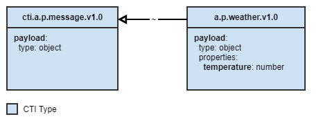

#### cti.id

`cti.id` - is the core annotation that specifies whether the property value of a CTI type is a CTI.

When specified, this allows for the creation of CTI instances that are derived from the type.

> [!NOTE]
> In RAMLx, CTI instances are described with root-level typed annotations.
> A typed annotation must define a type in the `annotationTypes` section and specify the array of CTI type.

```yaml
#%RAML 1.0 Library

uses:
  cti: cti.raml

annotationTypes:
  # Define a typed annotation.
  # The type must be an array of CTI type.
  Messages: MessageSettings[]

# Derive instances of the Message type
(MessageSettings):
  # Since the instance is derived from the Message type, it's CTI starts with cti.a.p.message_configuration.v1.0
  - id: cti.a.p.message_configuration.v1.0~a.p.weather_message.v1.0
    settings:
      format: application/json
  - id: cti.a.p.message_configuration.v1.0~a.p.timer_message.v1.0
    settings:
      format: application/xml

types:
  MessageSettings:
    # Defines a CTI type named cti.a.p.message_configuration.v1.0.
    (cti.cti): cti.a.p.message_configuration.v1.0
    (cti.final): false
    properties:
      id:
        type: cti.CTI
        # Specifies that the `id` property may be used as an identifier when deriving an instance.
        (cti.id): true
      settings:
        format:
          type: string
          enum: ['application/json', 'application/xml']
```

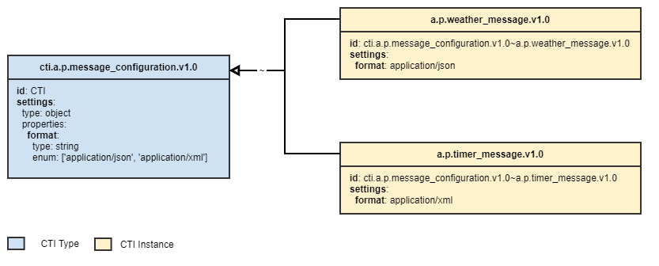

#### cti.description

`cti.description` - is a complementary annotation that specifies whether the property value of a CTI type is used for instance description.

Example:

```yaml
#%RAML 1.0 Library

uses:
  cti: cti.raml

annotationTypes:
  # Define a typed annotation.
  # The type must be an array of CTI type.
  Messages: MessageSettings[]

# Derive instances of the Message type
(MessageSettings):
  # Since the instance is derived from the Message type, it's CTI starts with cti.a.p.message_configuration.v1.0
  - id: cti.a.p.message_configuration.v1.0~a.p.weather_message.v1.0
    description: Defines configuration for the weather message.
  - id: cti.a.p.message_configuration.v1.0~a.p.timer_message.v1.0
    description: Defines configuration for the timer message.

types:
  MessageSettings:
    # Defines a CTI type named cti.a.p.message_configuration.v1.0.
    (cti.cti): cti.a.p.message_configuration.v1.0
    (cti.final): false
    properties:
      id:
        type: cti.CTI
        (cti.id): true
      description:
        type: string
        (cti.description): true
```

#### cti.reference

`cti.reference` - is a complementary annotation that specifies whether the property value of the CTI type is a reference to other CTI registered in the system.

Example:

```yaml
#%RAML 1.0 Library

uses:
  cti: cti.raml

annotationTypes:
  # Define a typed annotation.
  # The type must be an array of CTI type.
  MessageSettings: MessageSettings[]

# Derive instances of the MessageSettings type
(MessageSettings):
    # Since the instance is derived from the MessageSettings type, it's CTI starts with cti.a.p.message_configuration.v1.0
  - id: cti.a.p.message_configuration.v1.0~a.p.weather_message.v1.0
    settings:
      format: application/json

types:
  Message:
    # Defines a CTI type named cti.a.p.message.v1.0.
    (cti.cti): cti.a.p.message.v1.0
    (cti.final): false

    # Derived type must be instanciated with a reference to settings
    facets:
      cti-traits:
        settings:
          type: cti.CTI
          (cti.reference): cti.a.p.message_configuration.v1.0

    properties:
      payload:

  WeatherForecast:
    type: Message
    (cti.cti): cti.a.p.message.v1.0~a.p.weather_forecast.v1.0
    (cti.final): false

    # Derived type instanciates the values according to the traits schema of the parent type.
    cti-traits:
      # Since the value must be a reference to cti.a.p.message_configuration.v1.0,
      # the instance of cti.a.p.message_configuration.v1.0~a.p.weather_message.v1.0 is used.
      settings: cti.a.p.message_configuration.v1.0~a.p.weather_message.v1.0

    properties:
      payload:

  MessageSettings:
    # Defines a CTI type named cti.a.p.message_configuration.v1.0
    (cti.cti): cti.a.p.message_configuration.v1.0
    (cti.final): false

    properties:
      id:
        type: cti.CTI
        # Specifies that the `id` property may be used as an identifier when deriving an instance.
        (cti.id): true
      settings:
        format:
          type: string
          enum: ['application/json', 'application/xml']
```

The following diagram demonstrates the entity relationship that will be created as a result:

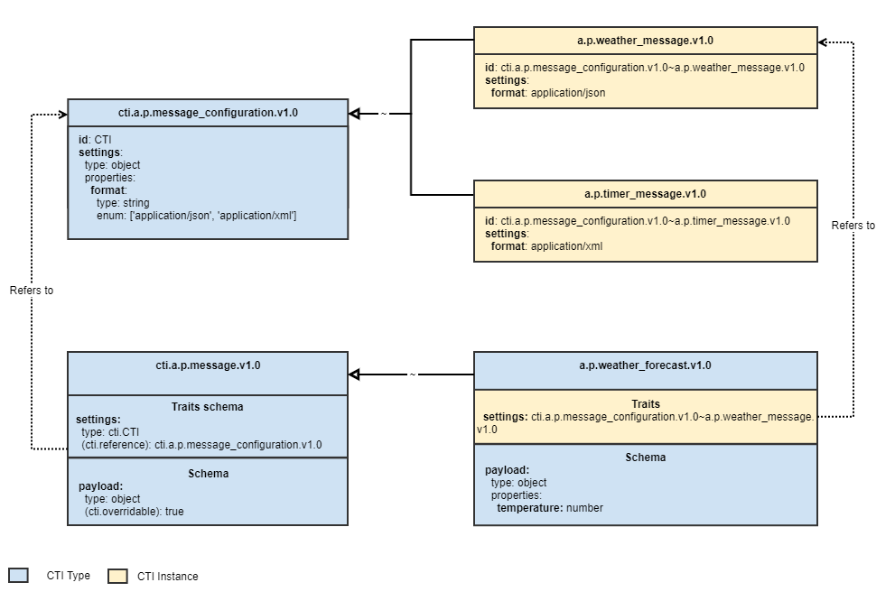

#### cti.final

cti.final - is a complementary annotation that specifies whether the CTI type may have derived CTI types or instances. By default, all CTI types are final.

This annotation has no effect when used in non-CTI types.

```yaml
#%RAML 1.0 Library

uses:
  cti: cti.raml

annotationTypes:
  # Define a typed annotation.
  # The type must be an array of CTI type.
  MessageSettings: MessageSettings[]

# Derive instances of the MessageSettings type
(MessageSettings):
  # Since the instance is derived from the MessageSettings type, it's CTI starts with cti.a.p.message_configuration.v1.0
  - id: cti.a.p.message_configuration.v1.0~a.p.weather_message.v1.0
    settings:
      format: application/json

types:
  Message:
    # Defines a CTI type named cti.a.p.message.v1.0.
    (cti.cti): cti.a.p.message.v1.0
    # (cti.final): true by default. Does not allow any inheritance.

    properties:
      payload:
        type: object
        (cti.overridable): true

  WeatherForecast:
    # This type inheritance will result in an error since cti.a.p.message.v1.0 is final.
    type: Message
    (cti.cti): cti.a.p.message.v1.0~a.p.weather_forecast.v1.0

    properties:
      payload:
        type: object
        properties:
          temperature: number

   MessageSettings:
    # Defines a CTI type named cti.a.p.message_configuration.v1.0
    (cti.cti): cti.a.p.message_configuration.v1.0
    (cti.final): false # Allow inheritance from the Message type

    properties:
      id:
        type: cti.CTI
        # Specifies that the `id` property may be used as an identifier when deriving an instance.
        (cti.id): true
      settings:
        format:
          type: string
          enum: ['application/json', 'application/xml']
```

The following diagram demonstrates the entity relationship that will be created as a result:

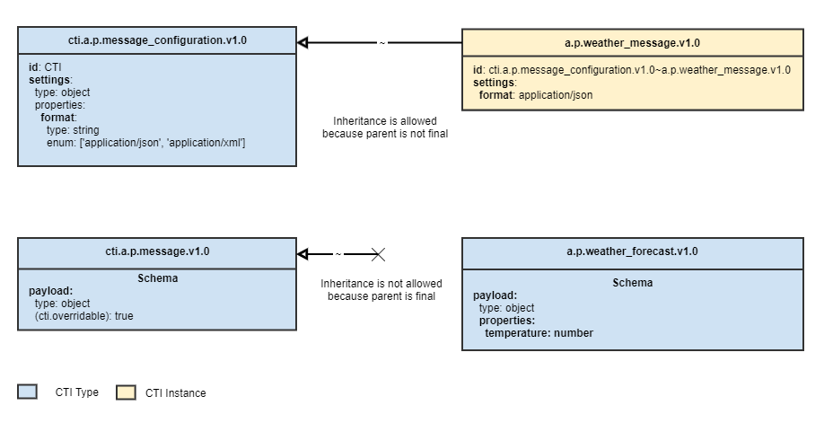

#### cti.overridable

`cti.overriable` - is a complementary annotation that specifies whether the object is overridable. This annotation can applied to both CTI type and object property.

```yaml
#%RAML 1.0 Library

uses:
  cti: cti.raml

types:
  MessageSettings:
    # Defines a CTI type named cti.a.p.message_configuration.v1.0
    (cti.cti): cti.a.p.message_configuration.v1.0
    (cti.final): false # Allow inheritance from the MessageSettings type

    properties:
      id:
        type: cti.CTI
        # Specifies that the `id` property may be used as an identifier when deriving an instance.
        (cti.id): true
      settings:
        format:
          type: string
          enum: ['application/json', 'application/xml']

  CustomMessageSettings:
    (cti.cti): cti.a.p.message_configuration.v1.0~a.p.custom_configuration.v1.0

    properties:
      settings:
        # This will result in an error. Extension of non-overridable object properties is not allowed.
        format:
          type: string
          enum: ['application/json', 'application/xml', 'text/plain']

  Message:
    # Defines a CTI type named cti.a.p.message.v1.0.
    (cti.cti): cti.a.p.message.v1.0
    (cti.final): false

    properties:
      payload:
        type: object
        (cti.overridable): true

  SystemNotification:
    type: Message
    (cti.cti): cti.a.p.message.v1.0~a.p.system_notification.v1.0

    properties:
      # This will result in an error. Extension of non-overridable CTI types is not allowed.
      message: string

  WeatherForecast:
    type: Message
    (cti.cti): cti.a.p.message.v1.0~a.p.weather_forecast.v1.0

    properties:
      payload:
        temperature: number
```

The following diagram demonstrates the entity relationship that will be created as a result:

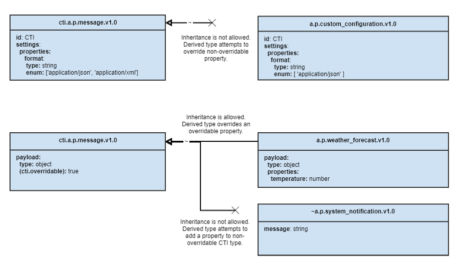

#### cti.schema

`cti.schema` - is a complementary annotation that specifies whether the property schema of the CTI type includes other CTI type schema registered in the system.

Example:

```yaml
#%RAML 1.0 Library

uses:
  cti: cti.raml

types:
  Message:
    # Defines a CTI type named cti.a.p.message.v1.0.
    (cti.cti): cti.a.p.message.v1.0

    properties:
      payload:
        type: object
        (cti.schema): cti.a.p.weather_schema.v1.0

  # This is an abstract type just for demo purposes.
  WeatherSchema:
    # Defines a CTI type named cti.a.p.weather_schema.v1.0.
    (cti.cti): cti.a.p.weather_schema.v1.0

    properties:
      type:
        type: string
        enum: ['RAINY', 'CLOUDY', 'SUNNY']
      temperature: float
```

As a result, this example may be expanded and written as follows:

```yaml
#%RAML 1.0 Library

uses:
  cti: cti.raml

types:
  Message:
    # Defines a CTI type named cti.a.p.message.v1.0.
    (cti.cti): cti.a.p.message.v1.0

    properties:
      payload:
        type: object
        (cti.schema): cti.a.p.weather_schema.v1.0
        (cti.cti): cti.a.p.weather_schema.v1.0
        properties:
          type:
            type: string
            enum: ['RAINY', 'CLOUDY', 'SUNNY']
          temperature: float
```

The following diagram demonstrates the entity relationship that will be created as a result:

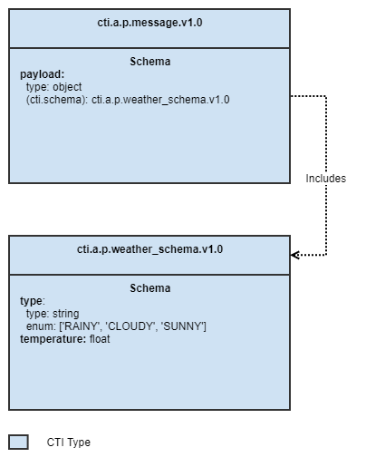

#### cti.access

`cti.access` - is a complementary annotation that specifies whether the CTI entity can be referenced by other vendors and/or packages.

## Packaging

The specification provides a way to group entities into packages to support local development.
A package represents a collection of entities provided by the vendor in this package.

### Package layout

> [!NOTE]
> All paths are relative to the package root.

- **index.json** - a package entry point that provides information about the package.
- **\*\*/\*.raml** - files in RAMLx 1.0 format that define CTI entities brought by this package.
- **.dep/** - a folder containing the dependent CTI packages.

The following example demonstrates a typical package structure:

```
my-package/
├─ .dep/
│  ├─ a.p/
│  │  ├─ .../
│  ├─ a.ui/
│  │  ├─ .../
├─ entities/
│  ├─ manifest.raml
├─ index.json
```

### Index file

Package must provide an index file that lists the RAMLx files with CTI entities.

| Field      | Type            | Description                                                                                            |
|------------|-----------------|--------------------------------------------------------------------------------------------------------|
| package_id | string          | An identifier of the package in the `<vendor>.<package_name>` format.                                  |
| entities   | array of string | A list of paths to RAMLx 1.0 files that define CTI entities.                                           |
| depends    | object          | An object where keys point to a package location on GitHub and value specifies a semantic version tag. |

The following example demonstrates such a file:

```json
{
  "package_id": "a.p",
  "entities": [
    "types.raml"
  ],
  "depends": {
    "github.com/vendor/pkg": "1.0.0"
  }
}
```

### Package management

To enhance local development experience, the specification provides a standard approach to package management.

#### Package identification

All packages are identified by the `package_id` field.

This field also restricts the package from providing entities of a foreign vendor and package.

#### Sources

Packages are downloaded using [`GOPROXY` protocol](https://go.dev/ref/mod#goproxy-protocol).

#### Versioning and compatibility

Packages follow the versioning as defined by [Go modules](https://go.dev/ref/mod#versions). The version is identifier by either of the following:

- By a semantic version tag provided by version control system.
- If no semantic version tag is available, By a [pseudo-version](https://go.dev/ref/mod#pseudo-versions).

#### Caching

A package manager must be able to support caching of downloaded packages and store them in a pre-defined location.

Packages storages uses the same structure as [`GOPROXY`](https://go.dev/ref/mod#goproxy-protocol) to store and access local packages.

The cache storage location is defined by the `CTIROOT` environment variable which may default to:

- On Linux/macOS, `$USER/.cti`.
- On Windows, `%USERPROFILE%/.cti`.

#### Dependency directory

A package manager must be able to create a `.dep` folder in the package working directory
and put all the packages by their `package_id`. The dependency directory is structured as a flat list
of packages since all packages are uniquely identified by their `package_id`.

#### Dependencies resolution

A package manager must be able to resolve direct and transitive dependencies based on the information provided in `index.json` of those packages.

In case there are a package manager encounters the same dependent package with a different version:

- It may implicitly upgrade a minor version or deny installation in case minor version is not the same.
- It must deny installation in case packages depend on different major versions of the package.

These rules are dictated by the dependencies folder structure. Since the dependencies folder is a flat list of packages that are uniquely identified
by the `package_id`, only one dependent package (either direct or transitive) may exist simultaneously.
